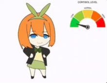

  
  
  
  

---

## Professional Summary

Soy estudiante de Ingenieria en Informatica en UPIICSA-IPN con enfoque en backend y automatizacion. Me interesa crear software util, mantenible y orientado a resolver problemas reales.

- Construyo soluciones de punta a punta: analisis, implementacion, pruebas y entrega.
- Me enfoco en APIs, procesos automatizados, manejo de datos y mejora continua.
- Busco fortalecer fundamentos de arquitectura, cloud y estandares de calidad.
- Trabajo con mentalidad de producto: claridad en objetivos, orden tecnico y resultados medibles.

Tambien me inspira la cultura japonesa y el anime, y lo integro como parte visual de mi perfil sin perder un enfoque profesional.

  
  

---

## Conocimientos Tecnicos

  
   
  
  
  

---

## Formacion y Ruta de Crecimiento

- Carrera: Ingenieria en Informatica, UPIICSA-IPN.
- Base tecnica actual: backend, scripting, SQL y herramientas de desarrollo.
- Objetivo de corto plazo: profundizar en diseno de APIs, arquitectura y despliegue en la nube.
- Objetivo de mediano plazo: consolidarme como backend developer con foco en automatizacion y escalabilidad.

  
   
  
   
  

---

## Power Level

  
  
   
  
   
  
   
  
  
  
   
  

---

## Contact

  
  

CDMX, Mexico · UPIICSA-IPN

