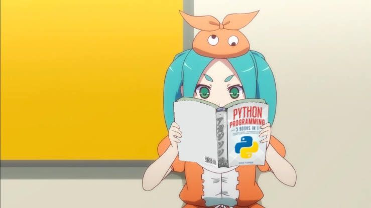
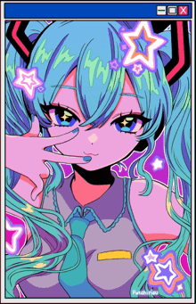
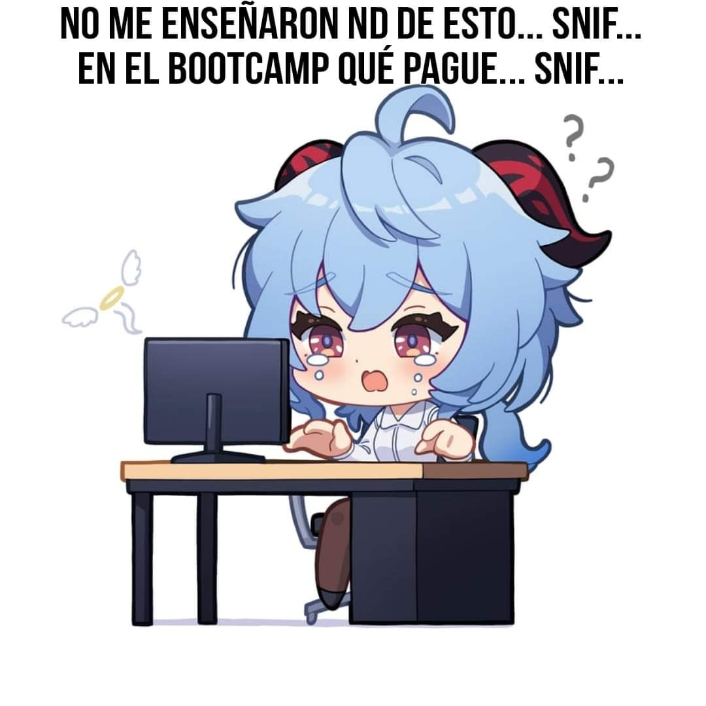

  
  
  
  

---

## Professional Summary

<table>
  <tr>
    <td width="60%" valign="top">
      Soy estudiante de Ingenieria en Informatica en UPIICSA-IPN con enfoque en backend y automatizacion.
        
      <ul>
        <li>Diseno y desarrollo soluciones de punta a punta: analisis, implementacion, pruebas y entrega.</li>
        <li>Trabajo con APIs, procesos automatizados, SQL y herramientas de desarrollo orientadas a productividad.</li>
        <li>Me enfoco en codigo mantenible, estructura clara y mejora continua de procesos.</li>
        <li>Objetivo profesional: consolidarme como backend developer con enfoque en escalabilidad y eficiencia.</li>
      </ul>
    </td>
    <td width="40%" align="center" valign="top">
      
       
      Disciplina y constancia en cada entrega
    </td>
  </tr>
</table>

---

## Conocimientos Tecnicos

  

<table>
  <tr>
    <td align="center" width="33%">
      
       
      Backend scripting
    </td>
    <td align="center" width="33%">
      
       
      Creatividad tecnica
    </td>
    <td align="center" width="33%">
      
       
      Energia para construir
    </td>
  </tr>
</table>

---

## Formacion y Ruta de Crecimiento

<table>
  <tr>
    <td width="55%" valign="top">
      <ul>
        <li>Carrera: Ingenieria en Informatica, UPIICSA-IPN.</li>
        <li>Base actual: backend, scripting, SQL, Linux y control de versiones.</li>
        <li>Corto plazo: reforzar diseno de APIs, arquitectura y despliegue cloud.</li>
        <li>Mediano plazo: escalar a proyectos con mejor observabilidad, calidad y automatizacion.</li>
      </ul>
      
       
      
    </td>
    <td width="45%" align="center" valign="top">
      
       
      
    </td>
  </tr>
</table>

---

## Power Level

  
  
   
  
   
  

<table>
  <tr>
    <td align="center" width="25%"></td>
    <td align="center" width="25%"></td>
    <td align="center" width="25%"></td>
    <td align="center" width="25%"></td>
  </tr>
</table>

---

## Contact

  

CDMX, Mexico · UPIICSA-IPN

